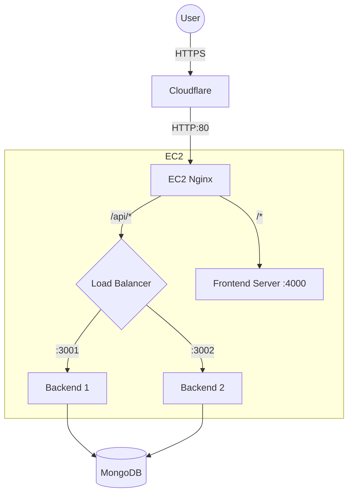

# Travel Memory Deployment Walkthrough

## Overview
The Travel Memory application has been successfully deployed to an AWS EC2 instance (Amazon Linux 2023). The application uses Nginx as a reverse proxy and load balancer, PM2 for process management, and Cloudflare for DNS and SSL.

## Deployed Architecture
- **Domain**: `https://nikhilappsstore.store`
- **Frontend**: React App (Served via PM2/Serve on port 4000)
- **Backend**: Node.js/Express (Load balanced via PM2 on ports 3001 & 3002)
- **Database**: MongoDB Atlas
- **Infrastructure**: AWS EC2 (t2.micro)
- **Security**: Cloudflare (Flexible SSL) + AWS Security Groups



## Changes Made
1.  **Backend**:
    -   Configured to use `process.env.PORT` for dynamic port assignment.
    -   Created `.env` for secure credential management (MongoDB Atlas connected).
    -   Improved error logging in `trip.controller.js` to expose database errors.
2.  **Frontend**:
    -   Updated `url.js` to point to `https://nikhilappsstore.store/api`.
    -   Fixed Mixed Content errors by forcing HTTPS.
3.  **Infrastructure**:
    -   Created `deployment/deploy_amazon_linux.sh` for automated setup.
    -   Configured Nginx (`deployment/nginx.conf`) to handle routing and load balancing.
    -   Configured PM2 (`deployment/ecosystem.config.js`) to manage 4 processes (2 Backend, 2 Frontend).

## Verification Results
| Component | Status | Verification Method |
| :--- | :--- | :--- |
| **Nginx** | ✅ Active | `systemctl status nginx`, `curl localhost` (200 OK) |
| **PM2** | ✅ Online | `pm2 list` shows 4 processes online |
| **Cloudflare**| ✅ Proxied | Site handles HTTPS, DNS resolves to Cloudflare IPs |
| **Connectivity**| ✅ Success | Site loads via `https://nikhilappsstore.store` |
| **Database**| ✅ Connected | Trips can be added and viewed (MongoDB Atlas) |

## Maintenance
-   **Restart Server**: `sudo reboot` (PM2 will auto-start)
-   **Update Code**:
    ```bash
    git pull origin main
    # If frontend changes:
    cd frontend && npm install && npm run build && cd ..
    # If backend changes:
    cd backend && npm install && cd ..
    # Apply:
    pm2 restart all
    ```
-   **Logs**: `pm2 logs` or `sudo tail -f /var/log/nginx/error.log`
