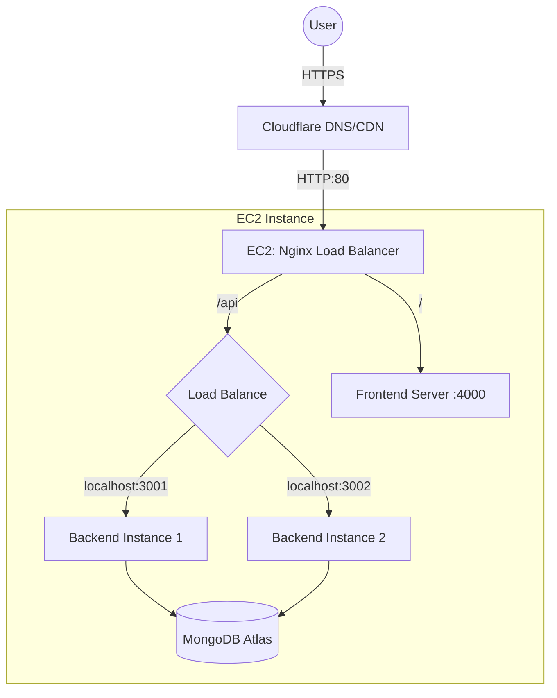

# Travel Memory Deployment Guide

This guide details the steps to deploy the Travel Memory MERN application on an AWS EC2 instance. The deployment includes setting up the backend and frontend, configuring Nginx as a reverse proxy and load balancer, scaling the application with PM2, and connecting a custom domain via Cloudflare.

## Prerequisites
- An AWS Account.
- A Custom Domain (managed via Cloudflare).
- Basic familiarity with terminal/SSH.

---

## 1. AWS EC2 Instance Setup

### Step 1.1: Launch Instance
1.  Log in to the AWS Management Console and navigate to **EC2**.
2.  Click **Launch Instance**.
3.  **Name**: `TravelMemory-Server`
4.  **AMI**: Select **Ubuntu Server 22.04 LTS** (or 20.04).
5.  **Instance Type**: `t2.micro` (Free tier eligible) or `t3.micro`.
6.  **Key Pair**: Create a new key pair (e.g., `travel-memory-key`) and download the `.pem` file. **Keep this safe.**
7.  **Network Settings**:
    -   **Security Group**: Create a new security group.
    -   **Inbound Rules**:
        -   Allow **SSH** (Port 22) from `My IP` (for security).
        -   Allow **HTTP** (Port 80) from `Anywhere` (0.0.0.0/0).
        -   Allow **HTTPS** (Port 443) from `Anywhere` (0.0.0.0/0).
        -   (Optional) Allow Custom TCP (Port 3000) for testing backend directly.
8.  **Storage**: Default (8GB gp2/gp3) is sufficient.
9.  Click **Launch Instance**.

### Step 1.2: Connect to Instance
Open your terminal (or Putty) and navigate to the folder with your key file.
```bash
chmod 400 travel-memory-key.pem  # Secure the key
ssh -i "travel-memory-key.pem" ubuntu@<EC2-Public-IP>
```

---

## 2. Server Environment Setup

Update package lists and install necessary tools: Node.js, NPM, Nginx, Git, PM2.

```bash
# Update Ubuntu
sudo apt update && sudo apt upgrade -y

# Install Node.js (v18.x recommended)
curl -fsSL https://deb.nodesource.com/setup_18.x | sudo -E bash -
sudo apt install -y nodejs

# Install Nginx
sudo apt install -y nginx

# Verify installations
node -v
npm -v
nginx -v

# Install PM2 globally
sudo npm install -g pm2
```

---

## 3. Application Deployment

### Step 3.1: Clone Repository
```bash
git clone https://github.com/UnpredictablePrashant/TravelMemory.git
cd TravelMemory
```

### Step 3.2: Backend Configuration
1.  Navigate to backend:
    ```bash
    cd backend
    ```
2.  Install dependencies:
    ```bash
    npm install
    ```
3.  create `.env` file:
    ```bash
    nano .env
    ```
    Content:
    ```env
    MONGO_URI=mongodb+srv://<your_user>:<your_password>@<your_cluster>.mongodb.net/travelmemory
    PORT=3000
    ```
    *(Replace with your actual MongoDB connection string)*. You can start with `PORT=3000` but we will override this with PM2 for load balancing.

### Step 3.3: Frontend Configuration
1.  Navigate to frontend:
    ```bash
    cd ../frontend
    ```
2.  Install dependencies:
    ```bash
    npm install
    ```
3.  **Update `url.js`**: Connect frontend to the backend load balancer (Nginx).
    ```bash
    nano src/url.js
    ```
    Change the base URL to your domain or EC2 Public IP:
    ```javascript
    // src/url.js
    export const baseUrl = "http://<YOUR_DOMAIN_OR_PUBLIC_IP>/api";
    // NOTE: We will configure Nginx to route /api to the backend.
    ```
4.  Build the React app:
    ```bash
    npm run build
    ```
    This creates a `build` folder.

---

## 4. Scaling & Load Balancing (PM2 Setup)

We will run multiple instances of the backend on different ports and let Nginx load balance between them. For the frontend, we will serve the static build files using `serve` (also multiple instances if strictly required by the assignment, though Nginx is usually enough for static files).

### Step 4.1: Install `serve`
To serve the frontend build with Node (if not just using Nginx root):
```bash
sudo npm install -g serve
```

### Step 4.2: PM2 Configuration
Create an `ecosystem.config.js` in the root (or `backend`) directory.

```bash
cd ~/TravelMemory
nano ecosystem.config.js
```

**Content**:
```javascript
module.exports = {
  apps: [
    {
      name: "backend-1",
      script: "./backend/index.js",
      env: {
        PORT: 3001,
        MONGO_URI: "YOUR_MONGO_URI_HERE" 
      }
    },
    {
      name: "backend-2",
      script: "./backend/index.js",
      env: {
        PORT: 3002,
        MONGO_URI: "YOUR_MONGO_URI_HERE"
      }
    },
    {
      name: "frontend",
      script: "serve",
      env: {
        PM2_SERVE_PATH: './frontend/build',
        PM2_SERVE_PORT: 4000,
        PM2_SERVE_SPA: 'true',
        PM2_SERVE_HOMEPAGE: '/index.html'
      }
    }
  ]
};
```
*Note: Make sure to copy the `MONGO_URI` into the file.*

### Step 4.3: Start Processes
```bash
pm2 start ecosystem.config.js
pm2 save
pm2 startup
```

---

## 5. Nginx Configuration (Reverse Proxy & Load Balancer)

Configure Nginx to listen on port 80, serve the frontend (or proxy to it), and load balance API requests to the two backend instances.

### Step 5.1: Create Configuration
```bash
sudo nano /etc/nginx/sites-available/travelmemory
```

**Content**:
```nginx
upstream backend_cluster {
    server 127.0.0.1:3001;
    server 127.0.0.1:3002;
}

server {
    listen 80;
    server_name <YOUR_DOMAIN_OR_PUBLIC_IP>;

    # Frontend Strategy 1: Proxy to PM2 serve instance (if used)
    location / {
        proxy_pass http://127.0.0.1:4000;
        proxy_http_version 1.1;
        proxy_set_header Upgrade $http_upgrade;
        proxy_set_header Connection 'upgrade';
        proxy_set_header Host $host;
        proxy_cache_bypass $http_upgrade;
    }

    # API Load Balancing
    location /api/ {
        # Rewrite url to remove /api prefix if backend doesn't expect it, 
        # OR keep it if backend routes handle it.
        # Assuming backend runs at root '/', we might need rewrite.
        # But looking at backend code: app.use('/trip', ...)
        # If frontend calls /api/trip, we rewrite.
        
        rewrite ^/api/(.*) /$1 break; 
        
        proxy_pass http://backend_cluster;
        proxy_http_version 1.1;
        proxy_set_header Upgrade $http_upgrade;
        proxy_set_header Connection 'upgrade';
        proxy_set_header Host $host;
        proxy_cache_bypass $http_upgrade;
    }
}
```

### Step 5.2: Enable Site and Restart Nginx
```bash
sudo ln -s /etc/nginx/sites-available/travelmemory /etc/nginx/sites-enabled/
sudo rm /etc/nginx/sites-enabled/default  # Remove default site
sudo nginx -t  # Test configuration
sudo systemctl restart nginx
```

---

## 6. Domain Setup (Cloudflare)

### Step 6.1: Add Site to Cloudflare
1.  Sign up/Login to Cloudflare.
2.  Add your domain (e.g., `example.com`).
3.  Change your domain's nameservers at your registrar (GoDaddy, Namecheap, etc.) to the ones provided by Cloudflare.

### Step 6.2: DNS Records
In Cloudflare Dashboard > DNS:
1.  **A Record**:
    -   **Name**: `@` (root)
    -   **Content**: `<EC2-Public-IP>`
    -   **Proxy status**: Proxied (Orange cloud) - This provides SSL automatically.
2.  **CNAME Record** (for www):
    -   **Name**: `www`
    -   **Content**: `example.com`
    -   **Proxy status**: Proxied.

**HTTPS**: Cloudflare provides "Flexible" or "Full" SSL. Since Nginx is listening on port 80 (HTTP), set Cloudflare SSL/TLS encryption mode to **Flexible**.

---

## 7. Verification

1.  Visit `http://<YOUR_DOMAIN>` (or `https` if Cloudflare is active).
2.  The Frontend should load.
3.  Interact with the app (Create a trip). The request should go to `/api/trip`, be handled by Nginx, forwarded to `backend_cluster` (3001 or 3002).
4.  Check PM2 logs (`pm2 logs`) to see which backend instance handled the request.

---

## Deployment Architecture


